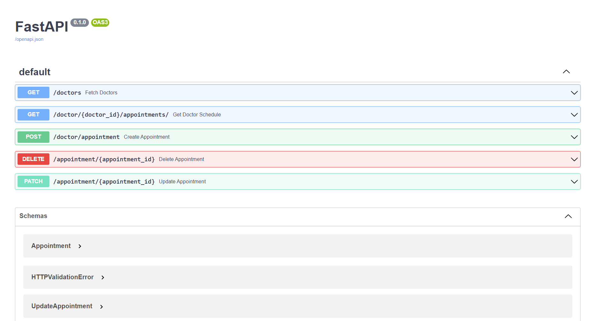
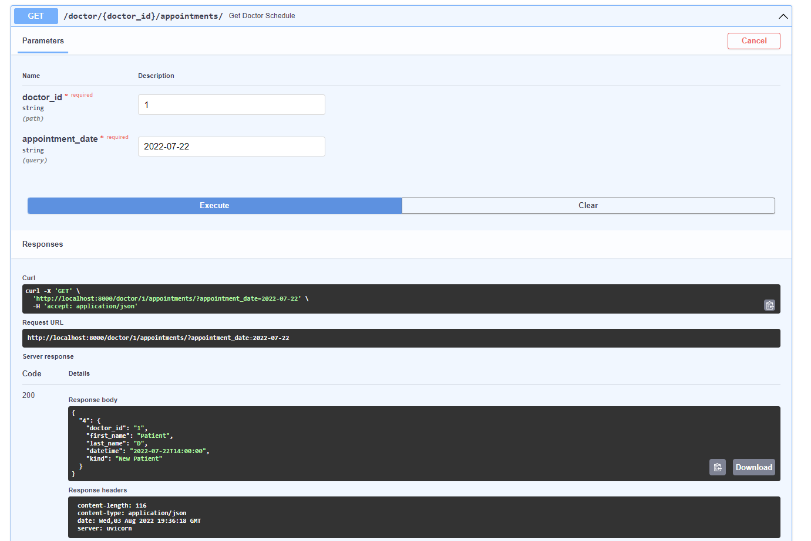
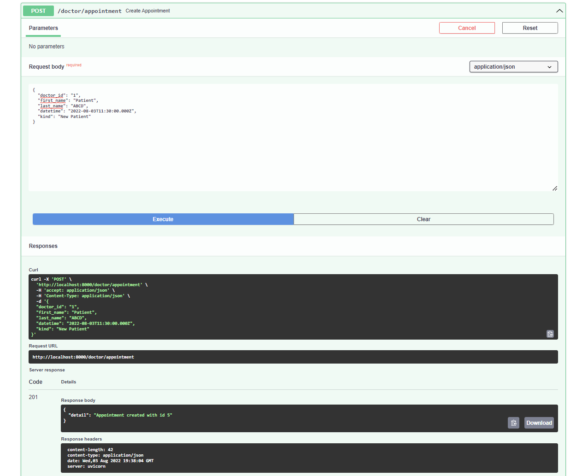
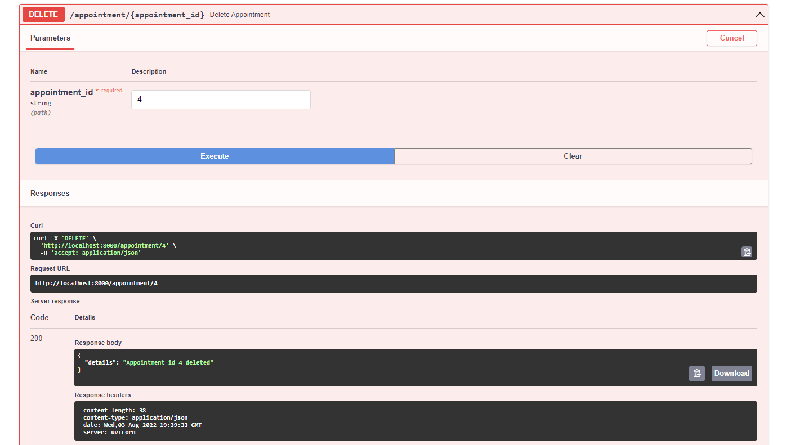
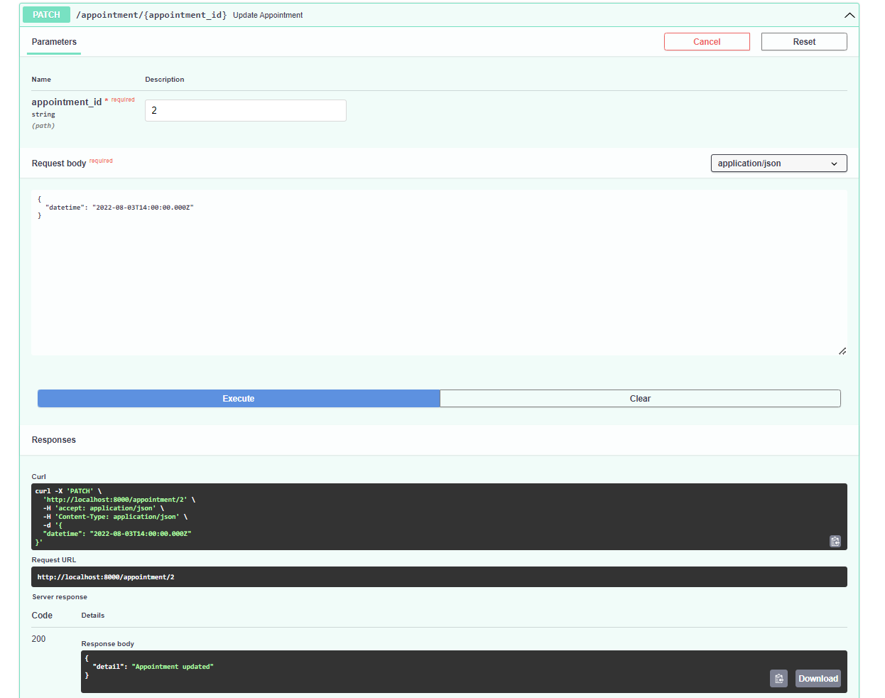

# Appointment Scheduling Tool
- I built this project as a way to learn how to use FastAPI, which is a fast and high performing web framework for building APIs. FastAPI also has interactive API documentation provided by Swagger UI, which is convenient for viewing and interacting with each endpoint.
- This tool is meant to be used as a backend API to integrate a doctor's appointment calendar. Users can see a list of all doctors in the network, see the doctor's appointment calendar, make/delete and update appointments.
## 🤖 Technologies
Python, FastAPI, OpenAPI(Swagger UI)
## ✨ Demo


GET: Fetch the schedule for a doctor by doctor_id for a certain date. Dates must be in isoformat.


POST: Make a new appointment <br>
Constraints - Appointments must be in 15 minute intervals and no more than 3 appointments are allowed for a time slot


DELETE: Delete an appointment by appointment_id


PATCH: Update an appointment by appointment_id. Any number of fields can be updated, but will return a 400 or 404 if appointment_id does not exist or appointment datetime is invalid or if time slots are full.

## Feature Updates
- Implement a database to make querying for appointments more robust. It will also allow us to build a relational model for doctors, users and appointments.
## Installation
To run this project, clone this repo:

Create and activate a virtual environment inside your directory

```bash=
python3 -m venv .env
source .env/bin/activate
```
Install the dependencies:
```
pip3 install -r requirements.txt
```
Run the app using:
```
uvicorn main:app --reload
```
You can now navigate to 'localhost:8000/docs' to access the API endpoints.

To run tests:
```
pytest
```